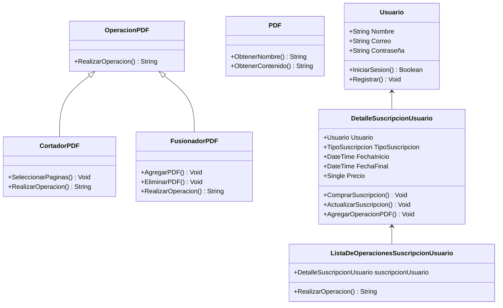

```mermaid
classDiagram

class CortadorPDF
CortadorPDF : +SeleccionarPaginas() Void
CortadorPDF : +RealizarOperacion() String

class DetalleSuscripcionUsuario
DetalleSuscripcionUsuario : +Usuario Usuario
DetalleSuscripcionUsuario : +TipoSuscripcion TipoSuscripcion
DetalleSuscripcionUsuario : +DateTime FechaInicio
DetalleSuscripcionUsuario : +DateTime FechaFinal
DetalleSuscripcionUsuario : +Single Precio
DetalleSuscripcionUsuario : +ComprarSuscripcion() Void
DetalleSuscripcionUsuario : +ActualizarSuscripcion() Void
DetalleSuscripcionUsuario : +AgregarOperacionPDF() Void

class FusionadorPDF
FusionadorPDF : +AgregarPDF() Void
FusionadorPDF : +EliminarPDF() Void
FusionadorPDF : +RealizarOperacion() String

class ListaDeOperacionesSuscripcionUsuario
ListaDeOperacionesSuscripcionUsuario : +DetalleSuscripcionUsuario suscripcionUsuario
ListaDeOperacionesSuscripcionUsuario : +RealizarOperacion() String

class OperacionPDF
OperacionPDF : +RealizarOperacion() String

class PDF
PDF : +ObtenerNombre() String
PDF : +ObtenerContenido() String

class Usuario
Usuario : +String Nombre
Usuario : +String Correo
Usuario : +String Contraseña
Usuario : +IniciarSesion() Boolean
Usuario : +Registrar() Void


OperacionPDF <|-- CortadorPDF
Usuario <-- DetalleSuscripcionUsuario
OperacionPDF <|-- FusionadorPDF
DetalleSuscripcionUsuario <-- ListaDeOperacionesSuscripcionUsuario

```
